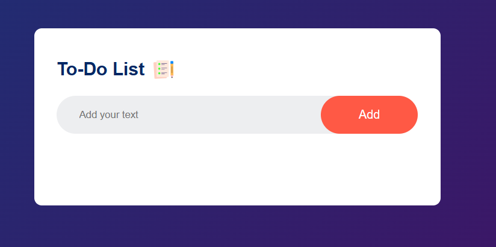
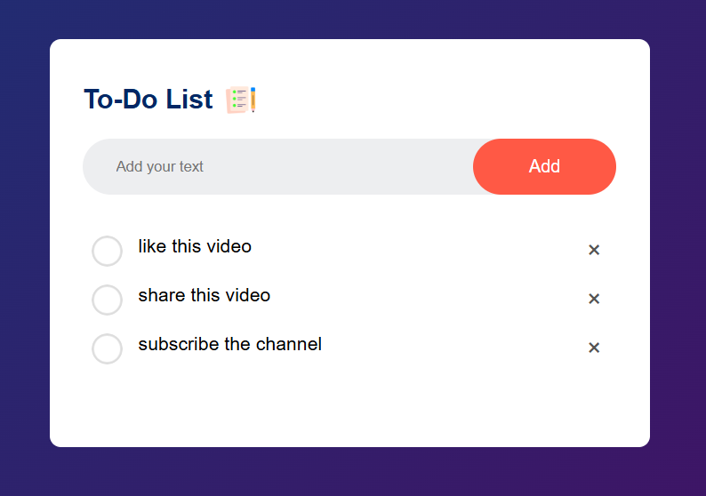
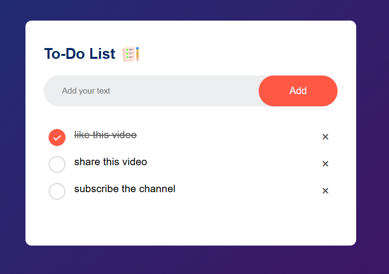
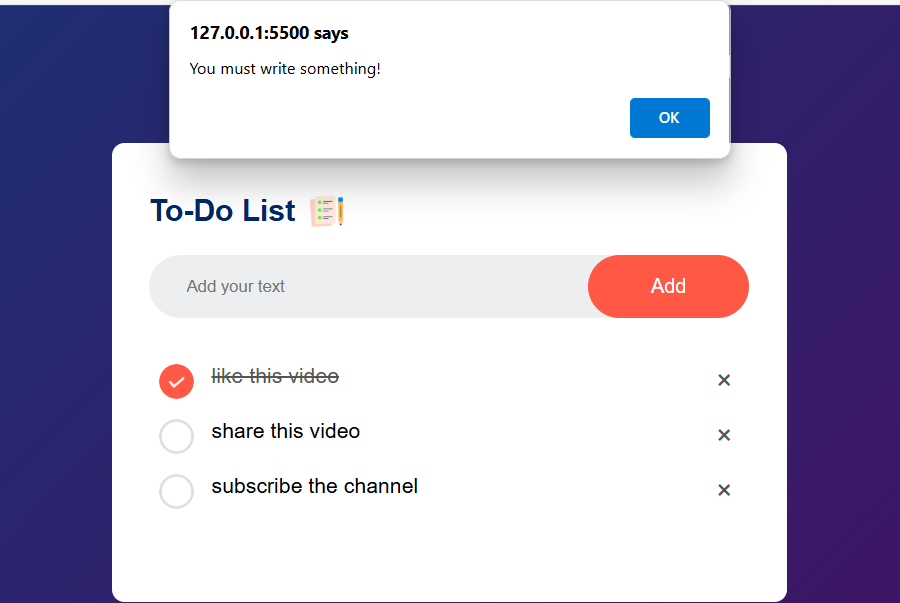
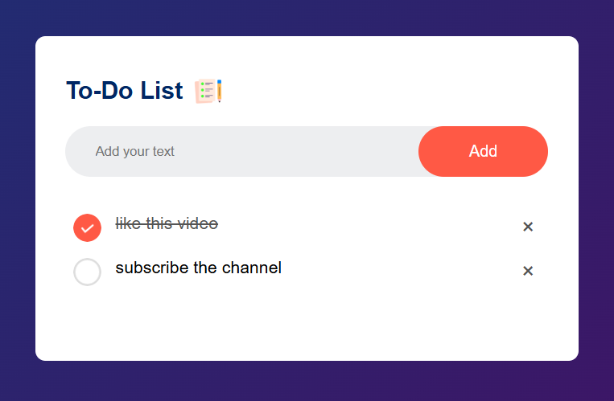

# 📝 To-Do List App
A simple and stylish To-Do List application built using **HTML**, **CSS**, and **JavaScript**. It allows users to add, mark, and delete tasks, with all data stored in the browser's local storage for persistence.

## 🚀 Features
- Add new tasks
- Mark tasks as completed
- Delete tasks individually
- Saves tasks using localStorage (tasks persist on page reload)
- Clean and responsive UI with modern design

## 🛠️ Tech Stack
- HTML5
- CSS3
- JavaScript (ES6)
- localStorage API

## 🧑‍💻 Author
Sivanathan Dilakshan
